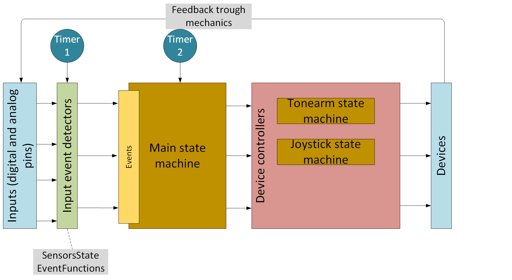

Main documentation

_____________________________________________________
Entire solution consists of three class levels, each aggregates/manages underlying level

Unit states
	Turntable itself is divided onto several almost independent units - Motor, Tonearm, Microlift etc. Every unit has associated Arduino input and output pins 
	that should be managed during turntable work cycle. Unit class encapsulates pin management logic for unit. 
	Unit has set of states - states of all pins. (For example when Play button is lit). Every such state is represented by Unit state class instance- static constant
	delivered together with class. 
	Unit classes are polyumorofhic and have two specific methods 
	- init. To ititialize pins (pinMode) - static method
	- apply. To set particular pin values that correspond to current unit state. 
	The following classes sre unit states:
	- Motor
	- TonearmState
	- DiskLed
	- Relays
	- SpeedButtons
	- TonearmButtons
	- TonearmState
	- Microlift
	- AutostopTimer
	
Global State
	Is represented by class State. Class aggregates particular instances of unit states into set of turntable global state. For example state when turntable is playing a record.
	Tohearm should be down, antiscate force should be applied, play button should lit etc. 
	See States and Events.xls for detailed list of states.

StateProcessor 
	Controls states change as result of current state and received event (button press, sensor etc). StateProcessor is implemented as state machine defined as matrix. 
	Matrix is defined in States and Events.xls - for every state there is defined- which event triggers which next state. 3/4 of events are ignored in a particular 
	state to avoid complex logic.

Events
	Enum that contains all events that can be processed by StateProcessor, but these events are not pin events. They are "high level state events". Some events are produced by timer,
	some by pins, some are derived from pins by logic. 

Tonearm control
	Tonearm direction is controlled by operational amplifier, both inputs of amplifier are supplied by arduino DAC0 and DAC1.

	DAC0 controls reference value applied to non-inverting input and is a constant.
	DAC1 is connected to inverting op-amp input (trough resistors- see scheme) and controls output voltage and tus - tonearm direction.

	Tonearm itself is controlled by multiple input sources:
	- position sensors: holder, first track and autostop- implemented and optocoupler and a shade. placed on tonearm axis. 
	- joystick with two directions - X direction controls tonearm movement left- right, Y direction controls tonearm rising and lowering
	- antiscate and damper resistors that controls antiscate force and damping factor when turntable is playing a record

Position sensors
	Four events (states) control tonearm position
	- TonearmPositionHolder
	- TonearmPositionOverGap
	- TonearmPositionOverDisk
	- TonearmPositionOnAutostop
	these four events are generated by three sensors. See Logic Diagrams drawings for definition - which event is generaded by which sensor in which state. 
	Tonearm direction is used in this algoryghm (to define what exactly happens when first track sensor is rising and falling. 
	Direction itself is refined by 

Joystick
	Joystick is used to move tonearm left and right only when tonearm is up. When tonearm is playing a record- joystick X axis value is ignored. 
	Nevertheless yoystick has analog output value for axis- it is used as a "button" - up - down.
	When joystick is moved up- there is a threshold. below the threshold it is considered ad MIDDLE- (i.e. it is not touched)
	After the threshold- it is considered as UP. I.e. value is "binarized" but to three values.

	Class JoystickUpDownState role is to detect when joystick events UpJoystickPress and DownJoystickPress are generated. But it doesn't perform this detection itself.
	It only reads current state from board and holds previous. StateProcessor calls state to read joystick value by timer and compares new value with previous

Antiscate and Damper. 
	Are taken into account when pickup is on disk and playing the record. Antiscate force is applied. Force is defined by two manual controls, provided as input
	voltages read from potentiometers:
	- antiscate level. Is read from input PIN_ANTISCATE
	- damper level. Is read from input pin PIN_DAMPER
	Damper is a resistance put in series to output solenoid to control reaction from move sensor voltage applied to solenoid. When resistance is increased- to keep
	constant output voltage (and this - antiscate force)- we should increase DAC1 output voltage
	
Timers:
	* Timer0 is used for autostop delayed function call. Autostop is ititiated not immediately after sensor is activated, but after interval for two reasons:
		- to simplify sensor position adjustment- sensor detects autostop somewhere near autostop position,
		- to play recordings in autostop trask (St.Peppers Lonly Hearts Club Band)
	* Timer1 is used to periodicaly check tonearm analog controls that can't produce events (joystick, damper and antiscate regulators) and update solenoid output voltage. 

	* Timer 2 is used by Stroboscope

Buttons and switches
	
	* Buttons have HIGH voltage in board input when is not presed and LOW when button is pressed. 
	Main event for buttons is presion, so- interrupt FALLING

	* Microlift sensors produce HIGH level when tonearm is up and LOW when it is down

	* Tonearm position optocouplers have LOW level when optical pair is shaded and HIGH when it is clear. 
